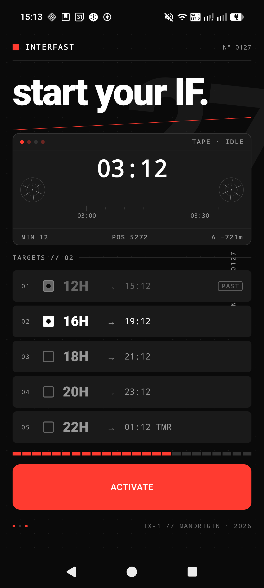
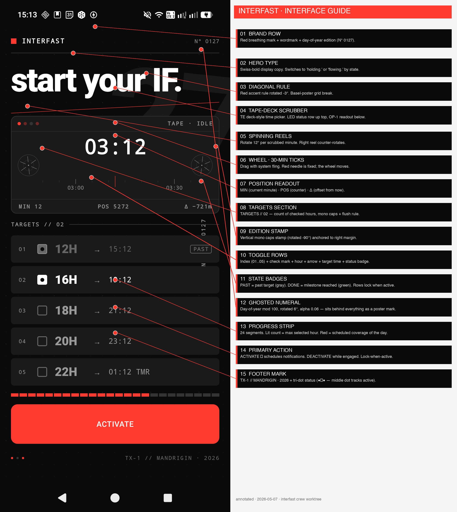

# Interfast

**The intermittent-fasting app that doesn't track you.**

Set the start time. Pick the milestones. Hit ACTIVATE. Your phone calls you at the right moments. That's the whole product.

<p align="center">
  
</p>

---

## Why this exists

Every other intermittent-fasting (IF) app I tried got it wrong in the same way: they treated fasting as a thing to **track**. So they shipped streaks, charts, weekly averages, completion rates, badges, calendars, in-app coaching, and a daily ritual of opening the app to log how you did.

Fasting doesn't need any of that. The protocol is simple — eat in a window, don't eat outside it. The only hard part is **knowing when each biological milestone hits** so you can decide, in the moment, whether to keep going. Everything else those apps add is friction, anxiety, or guilt-laundered as "engagement."

Interfast deletes all of it. The app is a **single-purpose scheduler**: pick a fast start time, check the milestone hours that interest you (12, 16, 18, 20, 22), tap ACTIVATE, put the phone in your pocket. The phone notifies you at each milestone with a STOP action. Eat whenever you want. The app forgets.

This is a deliberate stance against three failure modes that most habit / wellness apps share:

1. **Tracking creates anxiety.** Logging a fast that "broke" punishes the user for what is in fact a normal, healthy break. Streak mechanics weaponize loss aversion against the very habit they claim to support.
2. **Onboarding kills the habit before it starts.** Forcing the user to pick a protocol on day one (16:8? 18:6? OMAD? 5:2?) makes the decision feel weighty. The actual right answer is "fast until you're hungry, then eat" — and you can pick a longer milestone next time if it felt good.
3. **The phone in your pocket already knows the time.** What you need from a fasting app is *not* a clock. You need an unobtrusive ping at the moments when your body crosses a threshold (glycogen depletion → fat oxidation → ketosis → autophagy → growth-hormone peak). That's literally five timestamps. A ringtone could do it.

So Interfast is closer to a kitchen timer than a wellness app. And we made the timer feel like a piece of TE hardware on purpose — because the *act* of setting it up should be tactile and satisfying, not a form to fill out.

---

## How it works (in three sentences)

1. Drag the time wheel to where your last meal ended. Tap the milestones you care about.
2. Hit **ACTIVATE**. The screen locks; you cannot accidentally edit the schedule while running.
3. Your phone fires a notification at each checked milestone. Tap **STOP** on any of them to cancel the rest. That's it.

---

## UX principles, in order of importance

#### 1 · Set and forget. Always.

The single screen does everything. There is no settings page, no protocol picker, no statistics tab, no history calendar, no profile. Once you tap ACTIVATE, the app's job is to be **silent until the next milestone**. Habits stick when the cost of "doing it again tomorrow" is low — the cost of opening Interfast is one tap and one drag.

#### 2 · No streaks, no scores, no shame.

If you eat at hour 14 instead of waiting for 16, that is *fine* — it might even be the right call (you were hungry, you have plans, training session ran long). The app gives you a STOP button on every notification with no "are you sure" and no negative reinforcement. Tomorrow is identical to today.

This is the most counter-intuitive choice in the product. Every PM playbook says streaks drive retention. They do — they also drive the precise pattern (perfectionism → rebound → abandonment) that makes diet apps notorious. We optimize for fasting that *outlasts* the app, not for app-session minutes.

#### 3 · Milestones, not timers.

The five preset hours (12 / 16 / 18 / 20 / 22) aren't arbitrary picks; they map to biology:

| Hour | What's happening |
|---:|---|
| **12 h** | Glycogen reserves nearly depleted. Body shifts toward fat oxidation. |
| **16 h** | Insulin baseline. Lipolysis active. Most popular IF protocol endpoint. |
| **18 h** | Ketogenesis ramping. Mental clarity reported by long-term fasters. |
| **20 h** | Autophagy markers measurable in research literature. |
| **22 h** | Growth-hormone peak. OMAD-adjacent territory. |

You're not "competing" against these numbers. They're stations along a timeline; the notification just tells you the train passed one. Stop or keep going — your call.

#### 4 · The setup itself should feel mechanical.

The scrubber is built like an OP-1 tape transport: spinning reels that rotate as you scrub, an LED status row, a red position needle, and an instrument-style readout (`MIN 32 · POS 1432 · Δ +12m`). This is not decoration — it converts the moment of *picking a start time* from a "fill out a form" feeling into a "operate a piece of equipment" feeling. People run a habit longer when the ritual is satisfying.

#### 5 · The notification has to feel like a friend, not an alert.

Every milestone notification posts as a music-player-style card: a stylized poster bitmap as the backdrop (giant numerals, dot-matrix grid, segment strip showing position in a 24h cycle), with the title and body overlaid on a bottom gradient scrim. Tapping the **STOP** action cancels every later milestone — no later notifications, no pleading, no "we hope to see you back."

The notification is the entire UI surface for 99% of usage. It has to carry the brand and the tone alone. So we put real design effort into it.

#### 6 · Theme follows context, not a setting.

Light/dark switches automatically based on your phone's brightness slider (read live via a `ContentObserver` on `Settings.System.SCREEN_BRIGHTNESS`). When you turn the screen down at night, the app goes dark. There's no toggle to flip — there's nothing for the user to manage.

#### 7 · Privacy as the default, not a feature.

No accounts. No cloud. No analytics. No identifiers. Schedule state lives in `DataStore` on the device. Notifications are scheduled via `AlarmManager` (local). Nothing leaves the phone. The Privacy section of this README is short because there's nothing to disclose.

---

## The interface, annotated

<p align="center">
  
</p>

| # | Element | Purpose |
|---:|---|---|
| 01 | **Brand row** | Red breathing mark + `INTERFAST` wordmark + `N° {dayOfYear}` edition number. The square pulses while a session is running so you can tell at a glance. |
| 02 | **Hero headline** | `start your IF.` → `holding.` (active) → `flowing.` (a milestone has fired). Three states, no settings menu. |
| 03 | **Diagonal rule** | A red 1dp line rotated 3°. Basel-poster grid break — a reminder this is built like a printed thing, not a Material template. |
| 04 | **Tape-deck scrubber** | TE-flavoured time picker. Drag horizontally to move the start time. System fling physics. Wheel locks once active. |
| 05 | **Reels** | Rotate at 12° per scrubbed minute. Right reel counter-rotates. Pure visual feedback — they exist to make the scrub feel *physical*. |
| 06 | **Wheel** | 30-min major ticks with `HH:mm` labels around a fixed red needle. Whole-minute snap (so the displayed time is the exact alarm fire time). |
| 07 | **OP-1 readout** | `MIN` (current minute) · `POS` (4-digit position counter) · `Δ` (offset from now in minutes; goes red when in the future). |
| 08 | **Targets header** | `TARGETS // 02` — count of selected milestones, mono caps, paired with a flush rule. |
| 09 | **Edition stamp** | Vertical mono caps stamp anchored to the right margin, rotated -90°. Industrial-instrument detail. |
| 10 | **Toggle rows** | `01..05` index + check + hour + arrow + target time + status badge. Tap to toggle while inactive. |
| 11 | **State badges** | `PAST` (gray) when target is already in the past. `DONE` (phosphor-green) when the milestone fired during the current session. |
| 12 | **Ghosted numeral** | Day-of-year mod 100, rotated 6°, alpha 0.06 — sits behind everything as a poster mark that quietly changes daily. |
| 13 | **Progress strip** | 24 segments, lit count = max selected hour. Visualizes how much of the day your schedule covers. |
| 14 | **Primary action** | `ACTIVATE` (red, full width) → schedules notifications and locks the screen. `DEACTIVATE` while running. |
| 15 | **Footer mark** | `TX-1 // MANDRIGIN · 2026` plus a tri-dot status indicator. The middle dot tracks the active state. |

---

## What this app deliberately is NOT

Anti-feature list, because what we *don't* ship is part of the product:

- **No accounts.** You can't log in. There's nothing to log in to.
- **No streaks.** Missed days don't exist as a concept. There is no "day."
- **No history.** The app doesn't remember past sessions. Once you DEACTIVATE, the slate is clean.
- **No protocols.** "16:8", "18:6", "OMAD" aren't presets — they're emergent from which milestones you check.
- **No coaching, no tips, no nudges.** No motivational copy. No "you got this!" No emoji.
- **No notifications between milestones.** The app is silent until your next checked hour.
- **No widgets, no Wear OS, no lock-screen complications.** The notification IS the widget.
- **No CSV export.** There's nothing to export.
- **No dark-mode toggle.** Theme follows brightness automatically.
- **No onboarding.** The home screen is the onboarding.
- **No analytics.** Not even crash reporting.
- **No landscape mode.** Portrait only — this is an instrument, not a chart.

If you find yourself missing one of these, the answer is almost certainly that you're trying to use Interfast as a tracker. Use a different app for that — they're abundant and well-funded.

---

## The notification

A milestone notification is the entire UI surface during the 99% of the day when you're not in the app. So it's where most of the design effort went.

- **Backdrop**: a programmatically rendered bitmap (1024×512) — void-black, dot-matrix grid, condensed-bold numerals (the hour in 480px type), a small "INTERFAST · FAST · COMPLETE" mono-caps strip at the top, a 24-segment progress strip at the bottom (lit proportional to the milestone reached).
- **Layout**: full-bleed image with a bottom gradient scrim and the title + body overlaid in white mono caps with text shadow. Music-player notification style.
- **Action**: a single `STOP` button that cancels every remaining milestone in this session. No confirmation dialog.

Implementation: `NotificationCompat.DecoratedCustomViewStyle` + `setCustomBigContentView(RemoteViews)`. The collapsed view falls back to the system default so the shade row stays compact.

---

## Privacy

| Datum | Where it lives |
|---|---|
| Selected start time | `DataStore` (device only) |
| Checked milestone hours | `DataStore` (device only) |
| Active state | `DataStore` (device only) |
| Scheduled triggers | `AlarmManager` (device only) |
| Anything else | not collected |

There is no network code in this app. There is no SDK. There is no telemetry. The Android `INTERNET` permission is not declared.

---

## Tech

- Kotlin · Jetpack Compose · Material 3
- `DataStore` for persistence
- `AlarmManager.setExactAndAllowWhileIdle` for milestone scheduling (with `setAndAllowWhileIdle` fallback when exact-alarm permission isn't granted)
- `BroadcastReceiver` triplet: milestone → notification → STOP / boot-replay
- No DI framework. A tiny ServiceLocator on `InterfastApplication` exposes the repository and scheduler.
- No Hilt, no Room, no WorkManager, no Glance. (We removed all four during the rebuild.)

### Building

```bash
./gradlew :app:installDebug
```

JDK 17. Android SDK 34. minSdk 26.

### Architecture

```
app/src/main/java/com/interfast/
├── InterfastApplication.kt          ServiceLocator: scheduleRepository + alarmScheduler
├── MainActivity.kt                  hosts ScrubberScreen, requests POST_NOTIFICATIONS
├── alarm/
│   ├── AlarmScheduler.kt            wraps AlarmManager.setExactAndAllowWhileIdle
│   ├── FastNotificationReceiver.kt  fires the music-player-style notification
│   ├── StopActionReceiver.kt        STOP action — cancels later milestones
│   ├── BootReceiver.kt              re-registers active milestones after reboot
│   ├── NotificationArt.kt           Bitmap renderer (TE-style poster)
│   └── NotificationChannels.kt
├── data/ScheduleRepository.kt       DataStore-backed ScheduleState
└── ui/
    ├── theme/                       Color, Type, Theme, AmbientLight
    └── scrubber/
        ├── ScrubberScreen.kt        the entire app's UI
        ├── ScheduleViewModel.kt
        └── Pieces.kt                BrandHeader, HeroTitle, IndexedHourRow, …
```

---

## Inspirations

- **Teenage Engineering OP-1** — the tape transport metaphor for the scrubber, the giant numerical readouts, the LED pip indicators, the "instrument, not a screen" feel.
- **Nothing Phone / Nothing OS** — dot-matrix textures, monospace data labels, the discipline of a single accent color (Glyph Red).
- **Müller-Brockmann · Hofmann · Weingart** — Swiss modular grid, bold display type, deliberate diagonal grid breaks, edition / serial-number marks as graphic elements.
- **BJ Fogg, *Tiny Habits*** — friction at the decision point is the enemy of a habit; remove every step that asks the user to decide.
- **James Clear, *Atomic Habits*** — make the cue obvious (the milestone notification), make the action satisfying (the tactile setup), make the reward immediate (the body's own feedback).
- **Jason Fung, *The Obesity Code* / *The Complete Guide to Fasting*** — the biology of the milestone hours; the case for fasting as practice rather than performance.

---

## License

Apache 2.0. See [LICENSE](LICENSE).

---

*Interfast is a single-screen Android app. The goal of the project is to remain a single screen.*
